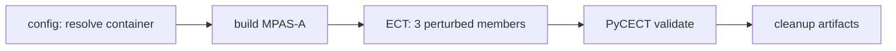

# MPAS-A CI/CD System

This page describes the **continuous integration** for MPAS-A as implemented in the [**MPAS-Model-CI**](https://github.com/NCAR/MPAS-Model-CI) repository (GitHub Actions, containers, test data). The CI code and the authoritative maintainer reference live there — in particular **[`AGENT_GUIDE.md`](https://github.com/NCAR/MPAS-Model-CI/blob/master/.github/AGENT_GUIDE.md)**.

This contributors guide summarizes behavior for **developers**; when in doubt, follow the CI repo and `AGENT_GUIDE.md`.

---

## Overview

MPAS-Model-CI provides:

| Capability | Notes |
|------------|--------|
| **Multi-compiler builds** | GCC, Intel oneAPI, NVHPC in Docker (`hpcdev`) |
| **CPU subset testing** | MPICH-based workflows on **push/PR** to default branches |
| **Ensemble Consistency Test (ECT)** | [PyCECT](https://github.com/NCAR/PyCECT) statistical validation — **not** bitwise identity to a single golden log |
| **Bit-for-bit (BFB) tests** | Optional workflows comparing NetCDF history variable data (I/O path, MPI decomposition, etc.) |
| **GPU (OpenACC)** | Full runs on NCAR **CIRRUS** self-hosted runners; **compile-only** NVHPC+CUDA check on GitHub-hosted runners |
| **Coverage & unit tests** | GCC coverage (`coverage.yml`); pFUnit (`unit-tests.yml`) |

---

## Where things live

| Location | Purpose |
|----------|---------|
| [`.github/workflows/`](https://github.com/NCAR/MPAS-Model-CI/tree/master/.github/workflows) | Caller workflows + **reusable** workflows (`_*`) |
| [`.github/actions/`](https://github.com/NCAR/MPAS-Model-CI/tree/master/.github/actions) | Composite actions: build, run, download test data, ECT validation, etc. |
| [`.github/ci-config.env`](https://github.com/NCAR/MPAS-Model-CI/blob/master/.github/ci-config.env) | Central configuration: image templates, release tags for test assets, MPI flags, Makefile targets |
| [`.github/AGENT_GUIDE.md`](https://github.com/NCAR/MPAS-Model-CI/blob/master/.github/AGENT_GUIDE.md) | Workflow map, conventions, how to add test cases |

---

## Architecture (subset CPU / ECT)

Thin **caller** workflows (e.g. `test-gcc-mpich.yml`, `test-nvhpc-mpich.yml`) invoke the reusable workflow **`_test-compiler.yml`**. A typical high-level flow:



- **Build** uses the **`build-mpas`** composite action (double precision, SMIOL by default for subset runs).
- **Run** uses **`run-perturb-mpas`** for three ensemble members (four MPI ranks each for the standard subset).
- **Validate** uses **`validate-ect`** against a **precomputed ensemble summary** file shipped as a GitHub release asset (not a hand-maintained “golden log” in the repo tree).

---

## Containers

Images are **`docker.io/ncarcisl/hpcdev-x86_64`** tags resolved from templates in **`ci-config.env`**, for example:

- **CPU:** `almalinux9-{compiler}-{mpi}-26.02` (with mappings such as `gcc` → `gcc14` in `ci-config.env`).
- **GPU:** `almalinux9-{compiler}-{mpi}-cuda-26.02`.
- **Intel** may use a **pinned** `leap-oneapi-*-25.09` image to avoid known compiler regressions — see comments in `ci-config.env`.

The **`resolve-container`** composite action substitutes `{compiler}` and `{mpi}` into those templates.

---

## Workflow triggers (policy)

| Class | Typical trigger | Purpose |
|-------|-------------------|---------|
| **MPICH CPU subsets** (`test-*-mpich.yml` for gcc/intel/nvhpc) | `push` / `pull_request` to **`master`** / **`develop`** | Fast feedback on PRs |
| **OpenMPI CPU** (`test-*-openmpi.yml`) | Often **`workflow_dispatch`** only | Same science checks; avoids noisy failures / resource use on every PR |
| **GPU ECT** (`test-gpu-*.yml`) | **`workflow_dispatch`** | Runs on self-hosted GPU runners; **not** tied to `pull_request` for security/policy |
| **NVHPC + CUDA compile-only** (`compile-nvhpc-cuda-mpich.yml`) | `push` / `pull_request` | Catches **toolchain** breakage without needing a GPU |
| **BFB** (`bfb-*.yml`) | **`workflow_dispatch`** and sometimes `push` to feature branches | Bitwise / NetCDF-variable checks |

Exact `on:` blocks are in each YAML file; treat `AGENT_GUIDE.md` as the living summary.

---

## Validation: ECT vs BFB

### Ensemble Consistency Test (ECT)

- **What it does:** Compares **perturbed** short simulations against a **stored PyCECT ensemble summary** (statistical consistency across members).
- **Typical resolution:** **120km** for subset ECT (see `ECT_RESOLUTION` and related variables in `ci-config.env`).
- **What it is not:** A check that logs or fields match a single reference run **bit-for-bit**; that is **BFB** (below).

### Running ECT yourself (HPC, no Docker)

CI uses **`hpcdev`** containers; for development on systems like **Derecho** or **Cheyenne**, you can run the **same PyCECT check** using your own modules, the **`120km`** test case and ECT assets from **MPAS-Model-CI** GitHub releases, and the **`perturb_theta.py` / `trim_history.py`** scripts in **MPAS-Model-CI**. Full step-by-step instructions (downloads, member loop, `pyCECT.py` command) are in **`AGENT_GUIDE.md`** in MPAS-Model-CI — section **“Running ECT without Docker (e.g. NCAR Derecho, Cheyenne)”**:  
<https://github.com/NCAR/MPAS-Model-CI/blob/master/.github/AGENT_GUIDE.md>

### Bit-for-bit (BFB)

- **What it does:** Compares **history NetCDF** variable data between runs that should be identical (e.g. different PIO vs SMIOL build, or different MPI rank counts).
- **Implementation:** Reusable **`_test-bfb.yml`** with a **`variants`** JSON array; comparison uses **`compare-bfb-nc.py`**.
- **Default resolution** for many BFB callers: **240km** (`BFB_*` in `ci-config.env`).
- **GPU BFB** (when present): NVHPC + CUDA + OpenACC, **dispatch-only** on CIRRUS — same policy as GPU ECT.

---

## Test case data (GitHub releases)

Test meshes and namelists are **not** committed as large tarballs under `.github/workflows/`. Instead:

1. Archives are **`{resolution}.tar.gz`** attached to **GitHub releases** on **MPAS-Model-CI** (e.g. tags like `testdata-240km-v1`).
2. **`ci-config.env`** defines **`RELEASE_TESTDATA_{RES}`** (resolution uppercased, `-` → `_`).
3. **`download-testdata`** downloads and caches the archive for the job.

**Adding a new resolution:** build the tarball, create a release with the asset, set the new `RELEASE_TESTDATA_*` variable, and point workflows at the new resolution — see **`AGENT_GUIDE.md`**.

---

## GPU testing

- **Full GPU ECT:** **`_test-gpu.yml`** — OpenACC build, runs on **`CIRRUS-4x8-gpu`**, validates with PyCECT.
- **Compile-only:** **`compile-nvhpc-cuda-mpich.yml`** — builds with OpenACC in a CUDA **container** on **GitHub-hosted** `ubuntu-latest` (no GPU execution).

---

## Known issues (informal)

- **NVHPC + OpenMPI** on some GitHub-hosted runners has shown **runtime/MPI** problems (e.g. exit 134); **MPICH** subsets are the primary PR gate. Check CI docs and issues in MPAS-Model-CI for current status.
- **Intel** images may stay on a **pinned** toolchain until upstream compiler issues are resolved — see **`ci-config.env`** comments.

---

## Artifacts and cleanup

Workflows upload **executables** and **history** or **logs** as GitHub Actions artifacts, then **delete** temporary artifacts in a cleanup job (often via the GitHub API) to save storage. Details vary by workflow; see the YAML files.

---

## Extending CI

1. Prefer **reusing** a composite action or reusable workflow before adding parallel job logic.
2. Centralize new image names, release tags, and MPI flags in **`ci-config.env`**.
3. **Document** changes in **`AGENT_GUIDE.md`** (MPAS-Model-CI) and open a PR against **MPAS-Model-CI**; then update **this page** if the contributor-facing summary changes.

---

## Troubleshooting

### Stack size (Intel Fortran)

```bash
ulimit -s unlimited
```

### OpenMPI in containers

MPI may be configured with flags such as **`--allow-run-as-root`** and **`--oversubscribe`** — see **`OPENMPI_RUN_FLAGS`** / `ci-config.env` and how **`run-mpas`** invokes **`mpirun`**.

### PIO vs SMIOL

Build-time: **`USE_PIO2`**, **`PIO_ROOT`** — see **`build-mpas`** and `ci-config.env`.

---

## Related links

- [**MPAS-Model-CI**](https://github.com/NCAR/MPAS-Model-CI) — repository
- [**AGENT_GUIDE.md**](https://github.com/NCAR/MPAS-Model-CI/blob/master/.github/AGENT_GUIDE.md) — CI maintainer reference
- [**ncarcisl/hpcdev on Docker Hub**](https://hub.docker.com/r/ncarcisl/hpcdev-x86_64)
- [**GitHub Actions documentation**](https://docs.github.com/en/actions)

---

## Contributing to CI/CD

Improvements belong in **MPAS-Model-CI** (workflows, actions, `ci-config.env`, `AGENT_GUIDE.md`). Open issues or pull requests there; this **contributors-MPAS-A** repo only holds this **high-level** summary for MPAS-A contributors.
