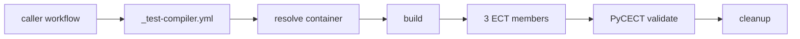

# Workflows & Triggers

Triggers below apply to the **NCAR/MPAS-Model-CI** repository (the clone
that receives the `push` / `pull_request` event), not to
**MPAS-Dev/MPAS-Model**. To run checks against your model branch, use
`workflow_dispatch` or cross-repo inputs — see
[Cross-repo testing](#cross-repo-testing).

A typical CPU subset run:

Caller workflows declare triggers and pass `compiler`/`mpi`/`precision` to
the reusable `_test-compiler.yml` (or `_test-gpu.yml`). Build, run, and
validation logic live in the reusable workflows and composite actions.

## Trigger policy

| Class | Trigger | Notes |
|-------|---------|-------|
| `test-*-mpich` | push/PR to `master`, `develop` on **MPAS-Model-CI** | Subset + ECT when the CI repo changes |
| `test-*-openmpi` | dispatch | OpenMPI in containers is noisy |
| `test-gpu-*` | dispatch | Self-hosted CIRRUS — security boundary |
| `compile-nvhpc-cuda-mpich` | push/PR to `master`, `develop` on **MPAS-Model-CI** | OpenACC/CUDA compile-only, no GPU |
| `ect-test` | push to `master` on **MPAS-Model-CI**; dispatch | Standalone ECT (GCC + OpenMPI, 120 km, GitHub-hosted) |
| `bfb-*` (CPU) | `workflow_dispatch`; some callers also enable `push` on specific branches | Bit-for-bit — read each YAML |
| `bfb-*-gpu`, `bfb-nvhpc-cpu-vs-gpu`, `profile-gpu-nsight` | dispatch | Inherit GPU policy |
| `coverage` | push to `master` on **MPAS-Model-CI** | GCC coverage to Codecov |
| `unit-tests` | push/PR to `master`, `develop` on **MPAS-Model-CI** | pFUnit across GCC 12/13/14 |

Exact `on:` blocks live in each workflow file under
[`.github/workflows/`](https://github.com/NCAR/MPAS-Model-CI/tree/master/.github/workflows).

## Cross-repo testing

`test-cross-repo.yml` accepts `mpas-repository` and `mpas-ref` inputs to
run the multi-compiler subset against any MPAS-Model commit (a fork, PR
branch, or upstream `develop`). The `checkout-mpas-source` action clones
the target source and overlays `.github/` from MPAS-Model-CI. Same
mechanism is built into `ect-test.yml` so a standalone ECT can be
dispatched against an external commit.

## Artifacts

Builds, history files, and logs are uploaded as GitHub Actions artifacts.
A cleanup job removes temporary artifacts at the end of each run. Profiler
output is kept for **3 days**.
